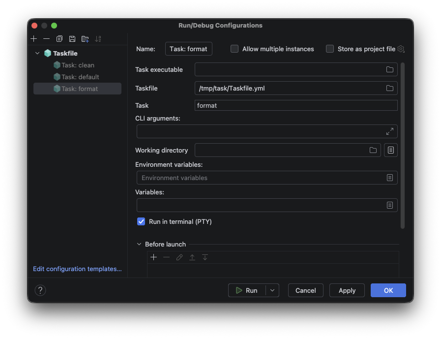
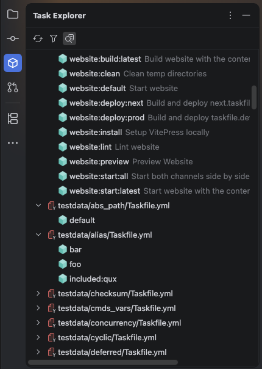
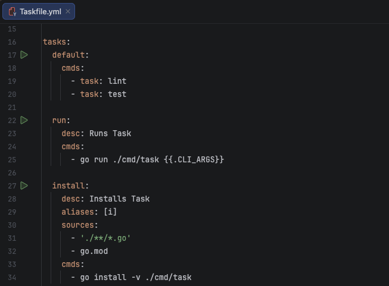
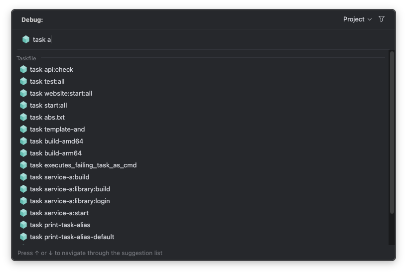
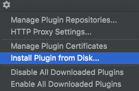

# Task IntelliJ Plugin


IntelliJ plugin for [Task](https://taskfile.dev/): run your `Taskfile.yml` tasks from the IDE.

## Features

### Run/Debug configuration



1. Open 'Run/Debug Configurations'.
2. Add `Taskfile`:
   * Task executable: Select `task` executable to run. Set empty to run `task` in `$PATH`.
   * Taskfile: Select `Taskfile.yml` file to use.
   * Task: Input task name to run. Completion offers the tasks found in the selected Taskfile.
   * CLI arguments: Input [CLI arguments](https://taskfile.dev/docs/guide#forwarding-cli-arguments-to-commands) to use.
   * Working directory: Left empty, the Taskfile's own directory is used. Path macros such as `$ProjectFileDir$` are supported.
   * Environment variables: See [Environment Variables](https://taskfile.dev/docs/guide#environment-variables)
   * Variables: See [Variables](https://taskfile.dev/docs/guide#variables)
   * Run in terminal (PTY): Run `task` under a pseudo-terminal, so tasks that colorize or redraw their output behave as they do in a shell. Turn it off for plain piped output.

### Task Explorer Tool Window



Open the `Task Explorer` tool window (left side bar by default).

Every `Taskfile.yml` in the project is listed. 
Expand one to see its tasks.

* Double-click, press Enter, or use the context menu's `Run` to run the selected task.
* `Go to Definition` (Ctrl/Cmd+B, or the context menu) opens the task where it is defined.
* `Show Internal Tasks` also lists tasks marked `internal: true`, which `task` itself omits.
* `Show Descriptions` shows each task's `desc:` next to its name.
* `Refresh` re-reads every Taskfile. This also happens automatically when a Taskfile is created, deleted, renamed, or edited.

### Gutter icons



Open a Taskfile in the editor and each task name gets a run icon in the gutter next to it.

Clicking it runs that task.

### Run Anything



Type `task <name>` in the Run Anything popup (`Ctrl` + `Ctrl`) to complete and run a task.

Task names from the project's Taskfiles are completed as you type, and the rest of the line is passed to `task` as written,
so flags (`task build --force`) and several tasks at once (`task build test`) work the same as they do in a terminal.

## Requirements

* IntelliJ platform 2026.2 or higher
* Install `task`. See [here](https://taskfile.dev/#/installation)
* Make sure the `task` command is in your `PATH`
* JDK 17 or higher to build from source

## Install from JetBrains Plugin Marketplace

Install [Taskfile Plugin](https://plugins.jetbrains.com/plugin/17058-taskfile) by searching `Taskfile` in plugin marketplace.

## Install from source

1. Build source
   ```bash
   $ ./gradlew build
   ```
2. Copy `build/distributions/task-intellij-plugin-*.zip` file.
3. In IntelliJ IDEA Preferences -> Plugin -> Install Plugin from Disk -> Select file from step 2. \
     
