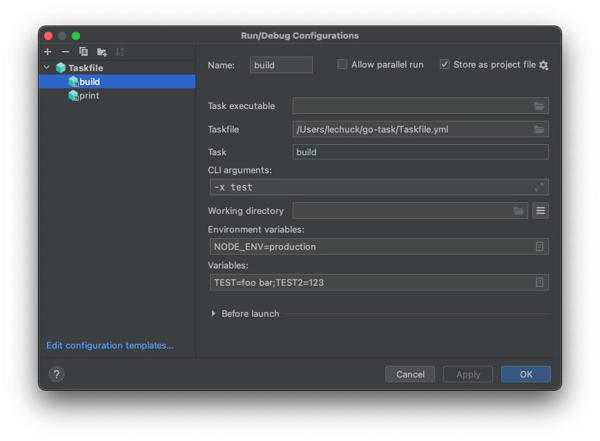

# Task IntelliJ Run Configuration Plugin


IntelliJ Run configuration plugin for [Task](https://taskfile.dev/).



## Requirements

* Install `task`. See [here](https://taskfile.dev/#/installation)
* JDK 8 or higher to build from source

## Install from JetBrains Plugin Marketplace

Install [Taskfile Plugin](https://plugins.jetbrains.com/plugin/17058-taskfile) by searching `Taskfile` in plugin marketplace.

## Install from source

1. Build source
   ```bash
   $ ./gradlew build
   ```
2. Copy `build/distributions/task-intellij-plugin-*.zip` file.
3. In IntelliJ IDEA Preferences -> Plugin -> Install Plugin from Disk -> Select file from step 2. \
     

## Usage

1. Open 'Run/Debug Configurations'.
2. Add `Taskfile`:
   * Task executable: Select `task` executable to run. Set empty to run `task` in `$PATH`.
   * Taskfile: Select `Taskfile.yml` file to use.
   * Task: Input task name to run.
   * CLI arguments: Input [CLI arguments](https://taskfile.dev/#/usage?id=forwarding-cli-arguments-to-commands) to use.
   * Working directory
   * Environment variables
